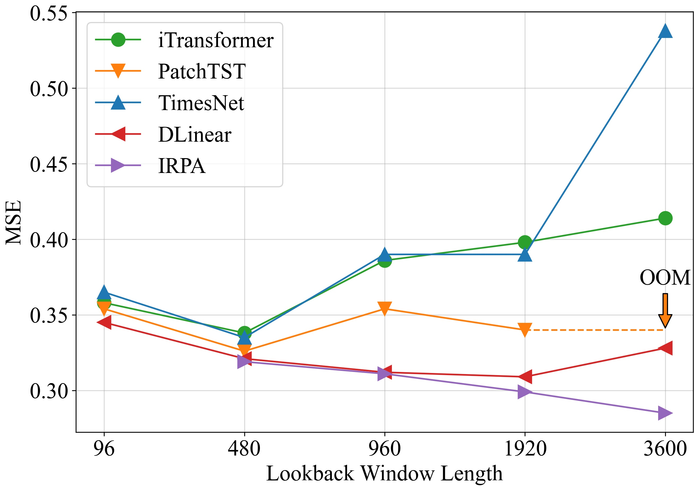
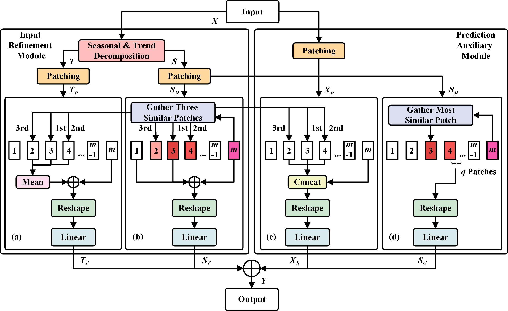

# IRPA (AAAI 2025)
Welcome to the official repository of the IRPA paper: [Efficiently Enhancing Long-term Series Forecasting via Ultra-long Lookback Windows](https://ojs.aaai.org/index.php/AAAI/article/view/35386).

## Background
Long-term series forecasting aims to predict future data over long horizons based on historical information. However, existing methods struggle to effectively utilize long lookback windows due to overfitting, computational resource constraints, or information extraction challenges, thereby limiting them to using limited lookback windows for predicting long-term future series. (As shown in the figure below, IRPA effectively mitigates these issues in the Weather dataset at prediction length k=720.)



## Overall Framework
**We propose the IRPA framework, a lightweight and efficient plug-and-play solution for long-term series forecasting that effectively leverages ultra-long lookback windows.** IRPA comprises the Input Refinement Module (IRM) and the Prediction Auxiliary Module (PAM), each constructed with two linear sub-modules. The IRM decomposes and patches ultra-long series, refines seasonal and trend features to enhance information density within limited lookback windows, and mitigates overfitting and parameter bloat. The PAM extracts historical similarities and seasonal patterns from lookback windows, thereby significantly improving prediction accuracy.



## Getting Started

### Installation

```bash
pip install -r requirements.txt
```
### Datasets
The datasets can be obtained from [Google Drive](https://drive.google.com/file/d/1Nm9B3rNPRrlbWH3XPmbPQaZs2ky55XGs/view?usp=drive_link). Then place the downloaded data in the folder`./dataset`.


### Train and evaluate

```bash
# Multivariate forecasting
bash ./scripts/multivariate_forecasting/Weather/IRPA.sh
...
```
## Citation

If you find this repo useful, please cite our paper.

```
@inproceedings{tong2025efficiently,
  title={Efficiently Enhancing Long-term Series Forecasting via Ultra-long Lookback Windows},
  author={Tong, Suxin and Yuan, Jingling},
  booktitle={Proceedings of the AAAI Conference on Artificial Intelligence},
  volume={39},
  number={20},
  pages={20912--20920},
  year={2025}
}
```

## Acknowledgement

We extend our heartfelt appreciation to the following GitHub repositories for providing valuable code bases and datasets:

https://github.com/thuml/Time-Series-Library
